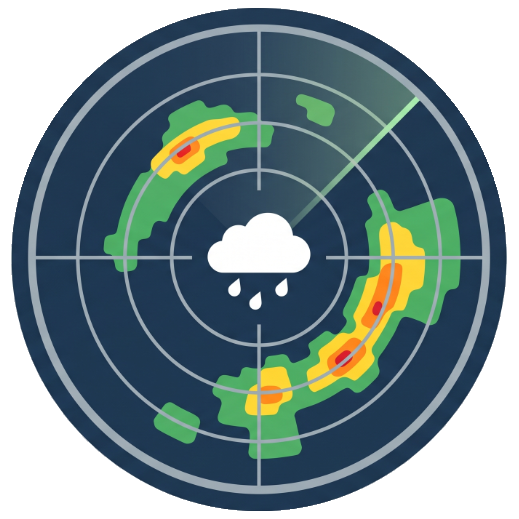

# DWD Regenradar Plasmoid

<p align="center">
  
</p>

KDE-Plasma-Widget (Plasma 6) fuer die Anzeige des DWD-Niederschlagsradars mit interaktiver Karte.

## Features

- **Interaktive Karte** — OpenStreetMap-Basiskarte mit Zoom und Pan (Qt Location)
- **DWD Radar-Overlay** — Transparentes Niederschlagsradar direkt vom DWD-WMS
- **Zeitgesteuerte Animation** — Play/Pause mit Slider und Uhrzeitanzeige
- **Verlauf & Vorhersage** — Toggle zwischen vergangenen Daten und Niederschlagsvorhersage
- **Legende** — Offizielle DWD-Niederschlagslegende als Overlay
- **Auto-Update** — Alle 5 Minuten automatische Aktualisierung

## Abhaengigkeiten

- KDE Plasma 6
- `qt6-location` (fuer die Kartenanzeige)

## Installation

```bash
cd plasma-rain-radar
kpackagetool6 -t Plasma/Applet -i .
```

Update:

```bash
cd plasma-rain-radar
kpackagetool6 -t Plasma/Applet -u .
```

## Plasma neu starten

Klassisch im Terminal:

```bash
kquitapp6 plasmashell
plasmashell --replace &
```

Oder via `systemctl` (moderner User-Space-Weg):

```bash
systemctl --user restart plasma-plasmashell.service
```

## WMS-Konfiguration (optional)

Die folgenden Variablen koennen in `scripts/fetch_frames.sh` gesetzt werden (Fallback-Modus):
- `WMS_BASE_URL` (Default: `https://maps.dwd.de/geoserver/ows`)
- `WMS_LAYER` (Default: `dwd:Niederschlagsradar`)
- `WMS_BBOX` (Default: `47.0,5.5,55.5,15.5` — Deutschland in EPSG:4326)
- `WMS_WIDTH`, `WMS_HEIGHT`
- `MAX_FRAMES`, `STEP_MINUTES`, `TIME_DIRECTION` (`future` oder `past`)

## GPU-basierte Bereinigung (Shader)

Das Radar-Overlay wird in Echtzeit über einen GLSL-Fragment-Shader ([radar_cleaner.frag](file:///home/tesla/githubprojects/plasma-rain-radar/contents/ui/radar_cleaner.frag)) bereinigt:
- **Grauer Hintergrund** und der **pinke Erfassungsrand** werden auf Pixelebene (inklusive Kantenglättung/Anti-Aliasing-Übergängen) herausgefiltert.
- Offizielle Niederschlagsfarben bleiben mathematisch garantiert unberührt.

## Entwicklung & Testing

### 1. Tests ausführen
Verwende das Unit-Test-Framework, um sicherzustellen, dass die Filterformeln korrekt arbeiten und keine Starkregen-Farben weglöschen:
```bash
python3 -m unittest tests/test_shader_logic.py
```

### 2. Visueller Filter-Simulator
Lade ein aktuelles Live-Bild herunter und teste Filterparameter interaktiv aus:
```bash
python3 tests/test_filter_visual.py
```

### 3. Shader kompilieren & Widget neu laden
Wenn du Änderungen am Shader vornimmst, kannst du diese mit dem reload-Skript direkt auf deinen Desktop bringen (erfordert `qsb` auf dem System):
```bash
./scripts/dev_reload.sh
```

## Datenquelle

Niederschlagsdaten: [DWD GeoServer](https://maps.dwd.de/geoserver/ows) (CC BY 4.0)
Kartendaten: © OpenStreetMap-Mitwirkende
